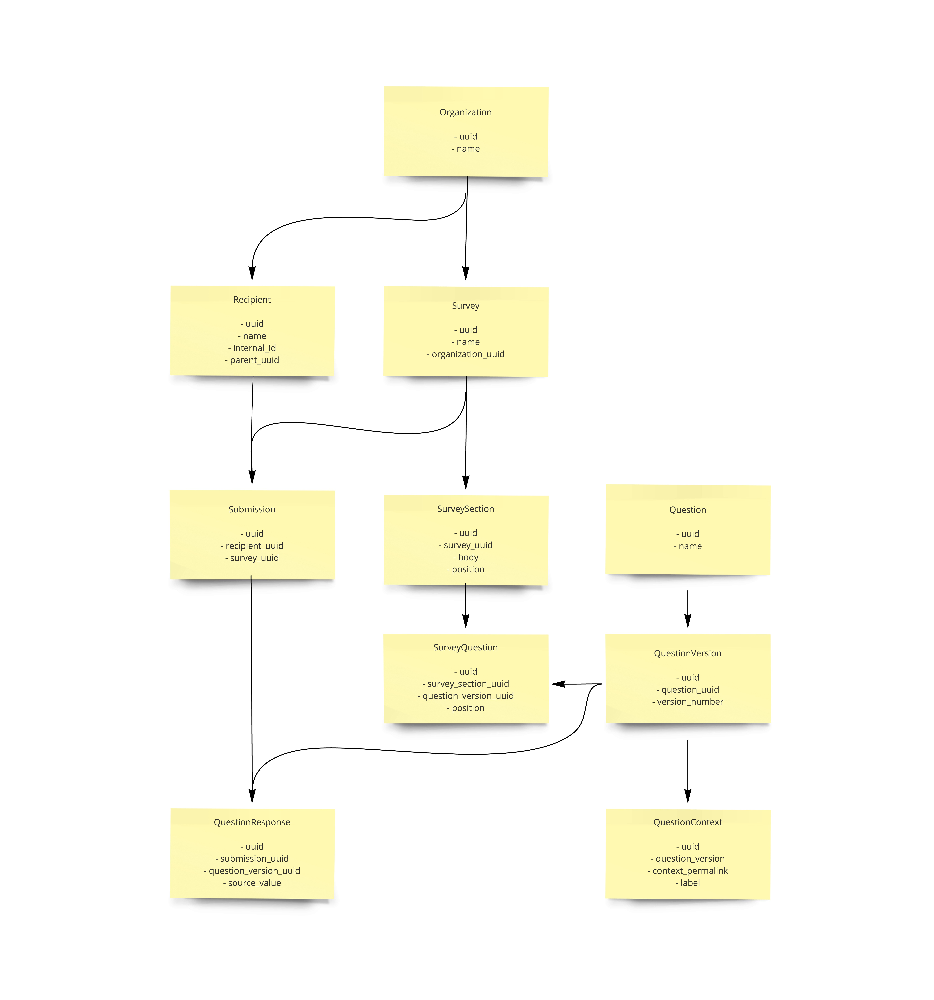

# Documentation

## Abridged Architecture

Below is a list (with accompanying diagram) showing the relevant object types, associations and attributes you may be querying to complete the challenge. You will not need to directly interact with all of these objects, but they are listed here for context.

There is much more to the system, so don't be alarmed if when you browse the docs you see many more object types and attributes.

> **Note**: Questions have multiple translations to display (QuestionContexts), but for the purposes of this coding challenge, you only need to deal with one (us_en).

- Organization
    - `uuid` - String - primary key
    - `name` - String
- Question - A question in the question bank that has multiple versions and translations
    - `uuid` - String - primary key
    - `name` - String
    - `field_type` - Enum
- QuestionVersion - A version of a Question
    - `uuid` - String - primary key
    - `version_number` - Integer
    - *belongs to a Question*
- QuestionContext - How to display a particular QuestionVersion in a specific language
    - `uuid` - String - primary key
    - `context_permalink` - String - shortcut to Context name
    - `label` - String
    - `hint` - String
    - *belongs to a Context*
    - *belongs to a QuestionVersion*
- Survey - An ordered collection of SurveySections
    - `uuid` - String - primary key
    - `name` - String
    - *belongs to an Organization*
- SurveySection - An ordered collection of questions with a heading
    - `uuid` - String - primary key
    - `body` - String
    - `position` - Integer
- SurveyQuestion - Dictates which QuestionVesion version to display and at which positoin within a SurveySection
    - `uuid` - String - primary key
    - `position` - Integer
    - *belongs to a SurveySection*
    - *belongs to a QuestionVersion*
- Recipient - A person, family or entity that fills out a Survey
    - `uuid` - String - primary key
    - `name` - String
    - `internal_id` - String
    - *belongs to an Organization*
- Submission - An instance of a Survey from a particular Recipient
    - `uuid` - String - primary key
    - *belongs to a Recipient*
    - *belongs to a Survey*
- QuestionResponse - An individual answer to a Question within a Submission
    - `uuid` - String - primary key
    - `source_value` - String (the response to the question in the context in which it was viewed)
    - *belongs to a Submission*
    - *belongs to a QuestionVersion*

## Choose how you will interact with the API:

**HTTP Requests**

If needed, examples of how to structure an HTTP request directly for the relevant resources are available at:

[https://documenter.getpostman.com/view/5125840/S1EH3hCf](https://documenter.getpostman.com/view/5125840/S1EH3hCf)

> Note: All queries and mutations are a `POST` request to the same endpoint with the query or mutation definition passed as JSON.

**GraphQL Client**

> Need to know more about GraphQL? [Get a quick overview](https://www.howtographql.com/basics/2-core-concepts/), or dive deep with a [full tutorial](https://www.howtographql.com/).

You can browse the generated docs and try out queries/mutations in the GraphiQL playground by:

1. Logging in to [api-dev.newstory.io](http://api-dev.newstory.io) with the provided credentials
2. Clicking on 'GraphiQL' in the left sidebar to open the playground
3. Clicking on '< Docs' in the upper right corner to browse the docs
4. Typing out a query or mutation in the left view pane
5. Clicking the Play button at the top to see the response in the right view pane

A short video showing how to experiment with the GraphiQL playground:

[https://www.useloom.com/share/64d03f7735084257ab5bb6c351536d14](https://www.useloom.com/share/64d03f7735084257ab5bb6c351536d14)
